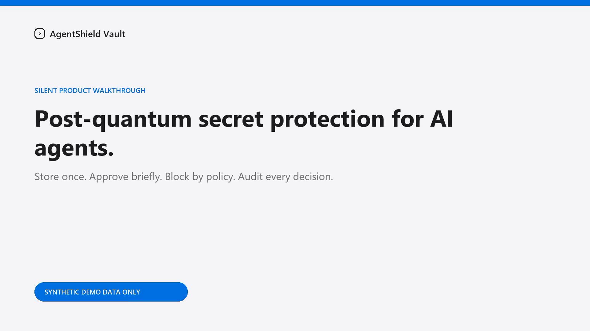
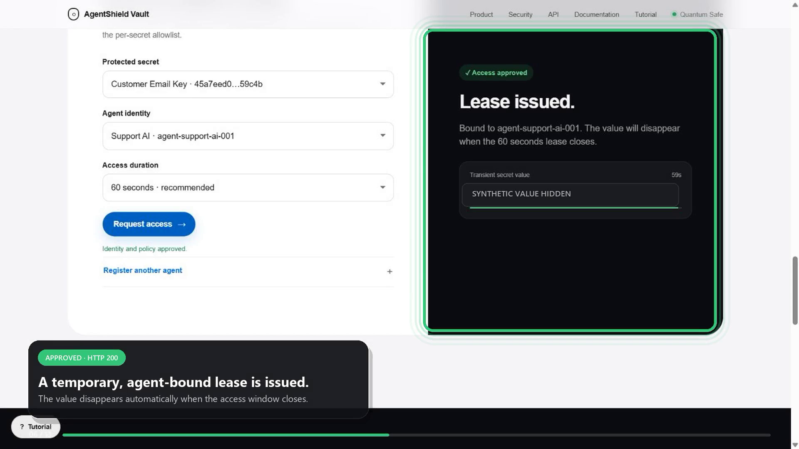
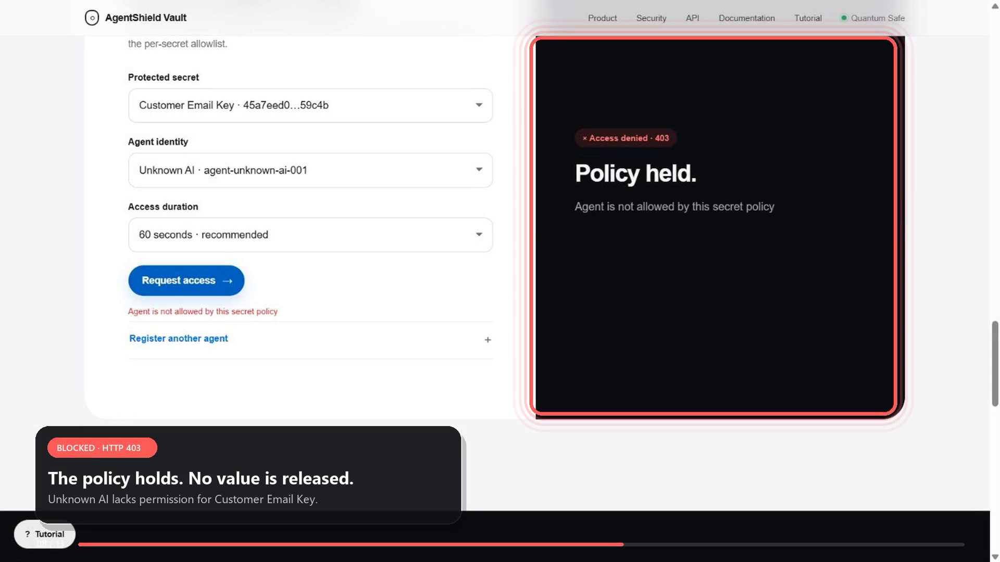

# AgentShield Vault

**The zero-trust, post-quantum security layer for autonomous AI agents.**

Live Demo:
https://agentsecure-vault.onrender.com

Note:
The free deployment may take a few seconds to wake after inactivity.


AI agents need API keys, database credentials, and deployment tokens to do useful work. Giving those credentials directly to an autonomous runtime turns the agent into a long-lived secret owner. AgentShield Vault keeps values encrypted and releases them only after a named agent passes a per-secret policy check. Approved access is short-lived, agent-bound, and auditable.

> Your AI agents need access. They should never own your secrets.

[](docs/demo/AgentShield_Silent_Tutorial.mp4)

**[Watch the silent 2:52 product walkthrough](docs/demo/AgentShield_Silent_Tutorial.mp4)** · [Voice-over script](docs/VOICEOVER_SCRIPT.md)

## What makes it different

- **Real post-quantum key establishment:** ML-KEM-768 encapsulates fresh key material for each stored secret.
- **Authenticated payload encryption:** HKDF-SHA256 derives a 256-bit key and AES-256-GCM encrypts the credential.
- **Agent identity:** every access request names a registered workload.
- **Least privilege:** each secret has its own allowlist, UTC access window, and daily request cap.
- **Just-in-time delivery:** successful requests receive an agent-bound lease that defaults to 60 seconds.
- **Inspectable evidence:** approved HTTP 200 and denied HTTP 403 decisions persist without values or access tokens.
- **Full lifecycle:** rotate and revoke encrypted records while preserving audit history.

## Demo story

The included walkthrough uses synthetic data only:

1. Store `Customer Email Key` and allow `Support AI`.
2. Request it as Support AI and receive a temporary HTTP 200 lease.
3. Request the same record as Unknown AI and receive HTTP 403 with no value.
4. Inspect ML-KEM ciphertext evidence and confirm `Plaintext field present: false`.
5. Review the value-free audit containing both decisions.





## Cryptographic data path

For every stored value:

1. ML-KEM-768 encapsulates a fresh shared secret to the vault public key.
2. HKDF-SHA256 derives a unique 32-byte key using the secret ID as salt.
3. AES-256-GCM encrypts the UTF-8 value with a fresh 12-byte nonce.
4. The secret ID and name are authenticated as additional data.
5. Only ciphertext, nonce, KEM encapsulation, algorithm metadata, and safe labels are persisted.

See [the architecture document](docs/ARCHITECTURE.md) for trust boundaries and the request sequence.

## Run locally

Python 3.11 or newer is recommended. Python 3.13 is used for the packaged deployment configuration.

### Windows PowerShell

```powershell
py -m venv .venv
.\.venv\Scripts\Activate.ps1
python -m pip install --upgrade pip
python -m pip install -r requirements.txt
$env:PQS_BACKEND = "cryptography"
$env:VAULT_AGENT_ID = "agent-demo-001"
uvicorn server:app --reload --host 127.0.0.1 --port 8001
```

### macOS or Linux

```bash
python3 -m venv .venv
source .venv/bin/activate
python -m pip install --upgrade pip
python -m pip install -r requirements.txt
export PQS_BACKEND=cryptography
export VAULT_AGENT_ID=agent-demo-001
uvicorn server:app --reload --host 127.0.0.1 --port 8001
```

Open [http://127.0.0.1:8001](http://127.0.0.1:8001). Interactive API documentation is available at [http://127.0.0.1:8001/docs](http://127.0.0.1:8001/docs).

## Deploy a public demo

The repository includes `render.yaml`, `.python-version`, and a deployment-specific dependency file. Follow [DEPLOYMENT.md](DEPLOYMENT.md) to create a public Render URL.

The free Render filesystem is temporary. This is useful for a disposable synthetic demo, but stored records reset when the service restarts or redeploys. Never enter a real credential into the public demo.

## API surface

| Method | Endpoint | Purpose |
|---|---|---|
| `GET` | `/health` | Backend, algorithm, audit, and score status |
| `POST` | `/agents` | Register an agent identity and permissions |
| `GET` | `/agents` | List safe agent metadata |
| `POST` | `/encrypt` | Encrypt a secret and attach a policy |
| `GET` | `/list_secrets` | List safe secret metadata only |
| `PUT/GET` | `/secret/{id}/policy` | Update or inspect a secret policy |
| `POST` | `/request_access` | Evaluate policy and issue a short lease |
| `GET` | `/lease/{token}` | Use a still-valid agent-bound lease |
| `PUT` | `/secret/{id}` | Rotate and re-encrypt a secret |
| `DELETE` | `/secret/{id}` | Revoke ciphertext while retaining audit history |
| `GET` | `/security_proof/{id}` | Inspect safe ciphertext evidence |
| `GET` | `/audit` | Read persistent value-free events |
| `GET` | `/security_score` | Read evidence-backed posture checks |
| `GET` | `/security_report` | Download a metadata-only report |

## Test coverage

Fourteen focused tests cover encryption and decryption, no-plaintext persistence, safe proofs, identity and policy decisions, daily limits, agent-bound lease expiry, authorized 200 versus blocked 403, rotation, revocation, audit retention, and value-free reports.

```bash
python -m pytest tests -q
```

GitHub Actions runs the same suite on pushes and pull requests.

## Repository guide

- `dashboard.html` — polished responsive product interface
- `server.py` — FastAPI endpoints and response boundaries
- `vault.py` — ML-KEM, HKDF, and AES-GCM data plane
- `control_plane.py` — identities, policies, leases, and audit
- `tests/` — crypto, API, and policy tests
- `docs/` — architecture, submission copy, presentation flow, screenshots, and voice-over
- `render.yaml` — public demo deployment configuration

## Responsible prototype boundary

This repository is a working hackathon prototype, not a production identity provider or HSM-backed vault. The public demo uses demonstration identity claims and local JSON persistence. Production should add attested workload identity, hardware-backed keys, transactional storage, TLS termination, rate limiting, and a tamper-evident audit sink. Read [SECURITY.md](SECURITY.md) before deployment.

Never use real production credentials in this project or its public demo.

