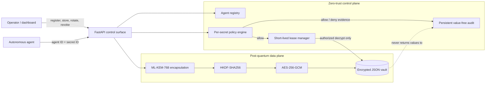
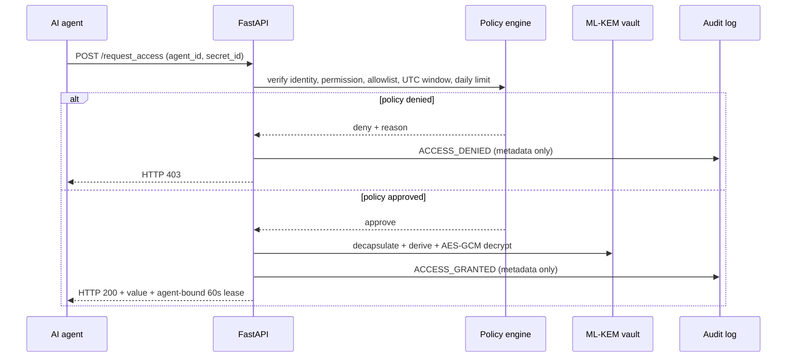

# AgentShield Vault architecture

## System view

The control plane stores identities, policies, lease state, and audit metadata. The data plane stores cryptographic material and encrypted records. Secret values never enter lists, proofs, audit events, scores, or reports.

## Access decision sequence

## Storage boundaries

| Store | Persists | Explicitly excludes |
|---|---|---|
| `secrets.json` | KEM ciphertext, AES-GCM ciphertext, nonce, labels, timestamps | plaintext, shared secret, derived AES key |
| `agents.json` | identity ID/name/status/permissions | credentials or secret values |
| `policies.json` | allowed agents, time window, request limit | values and keys |
| `audit_log.json` | action, agent ID, secret ID, time, HTTP status, reason | values, tokens, key material |
| process memory | short-lived opaque lease token mapping | durable secret copies |

## Production evolution

Replace the local identity claim with attested workload identity; move ML-KEM private-key operations to an HSM/KMS; move metadata to a transactional store; export audit events to an append-only or tamper-evident sink; put the API behind TLS, rate limiting, and service authorization. The cryptographic and policy boundaries in this prototype make those substitutions explicit.
